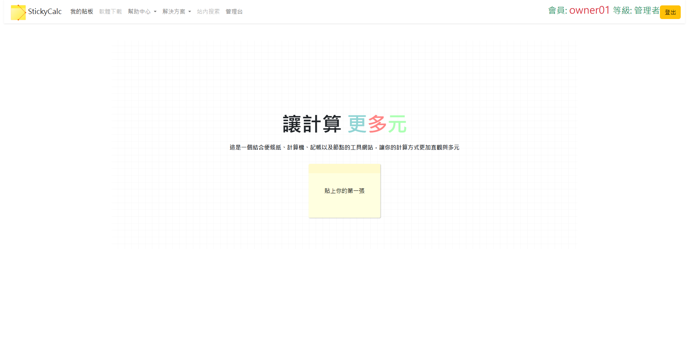
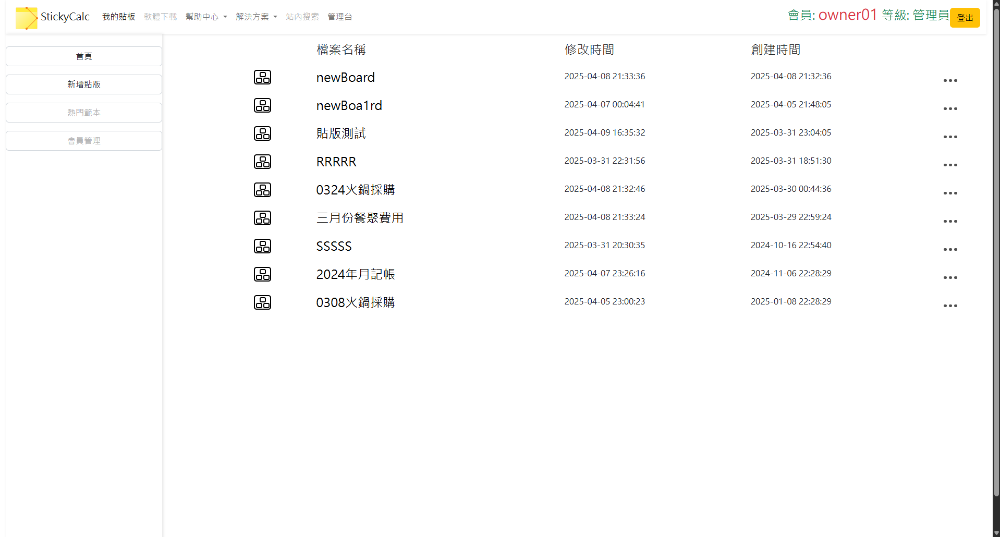
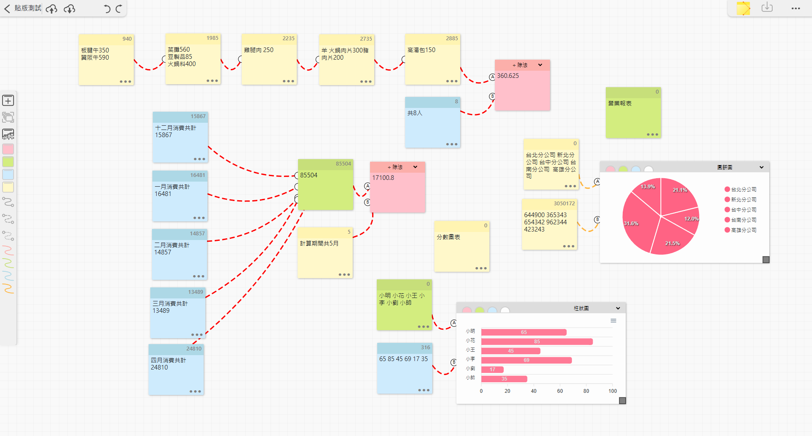

# ⚙️ 功能簡介

這是一款結合便利貼、節點、計算機與圖表的網頁工具，主要功能如下：

- 📝 會員註冊與登入功能  
- ☁️ 雲端儲存與載入便利貼與版面資訊  
- 🧾 便條紙文章紀錄  
- 🔗 節點連線計算功能  
- 📊 圖表展示 (ApexCharts)  
- 💰 記帳與資金管理  

---

# 🔗 其他連結

- 🎨 [Figma 設計稿](https://www.figma.com/design/06pza9HIq9AiYhsaWd2IAy/%E4%BE%BF%E5%88%A9%E8%B2%BC%E8%A8%88%E7%AE%97%E6%A9%9F?node-id=22-16&m=dev&t=o2I7e6h9DV6knzuh-1)
- 🧠 [發想心智圖](https://gitmind.com/app/docs/md08bsq9)

---

# 📷 專案畫面展示

<!-- 若使用本地圖片可改為 ./images/filename.png，需與 Markdown 同目錄 -->

---

# 🗂️ 專案技術總覽

本專案技術採用前後端分離，前端程式放置於Github，後端API架設於AWS EC2 ubuntu

| 🔧 前端 | 🖥️ 後端 | 💾 資料庫 | 🛠️ 其他工具 |
|-------------|---------------|------------|----------------|
| HTML5       | PHP           | Linux (Ubuntu) | Figma         |
| JavaScript  | SQL           | MySQL         | Git            |
| Vue 3       |               |               | GitHub         |
| jQuery      |               |               | AWS EC2        |
| Bootstrap   |               |               |                |
| SweetAlert  |               |               |                |
| ApexCharts  |               |               |                |
| AJAX        |               |               |                |
| CSS         |               |               |                |

---

# 📬 聯絡作者

- 👤 作者：Shawn  
- 📧 Email：pipaeppe@hotmail.com  
